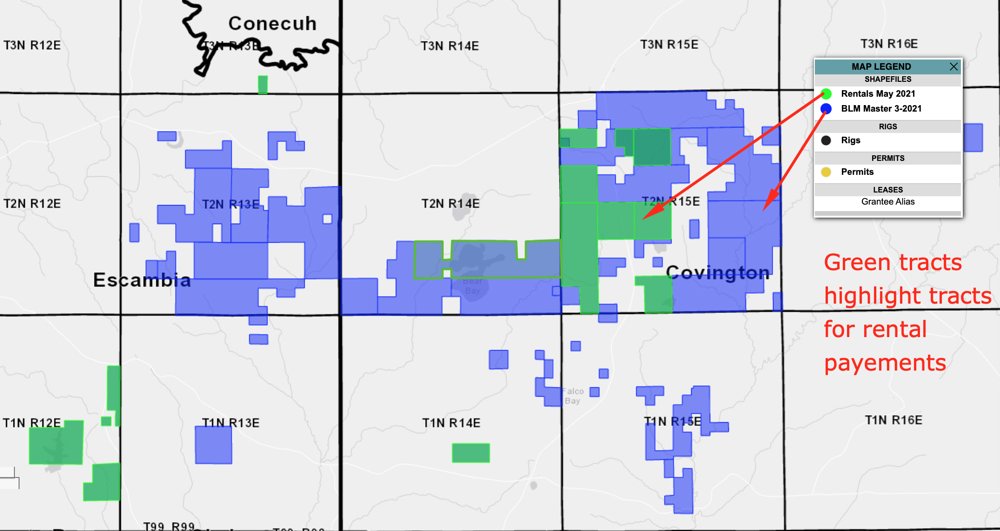

# BLM-Rentals-Shapefile

# Project Goal
* Create an extracted ESRI shapefile from company's master shapefile to effectively present high priority data to management.

### Screenshot of Final Results - Extracted File Hosted on Web Map

 

# Script Overview
Ad-hoc script used internally to generate a filtered shapefile to identify rental tracts from our master shapefile.
The script will read in an excel sheet and filter the master shapefile with Pandas & Geopandas.

Cleanup text functions will be used to avoid mismatches based on trivial misspellings (whitespace, case sensitivity, erroneous special characters, etc.)

 

# Workflow:
Member of accounting will submit a list each month with leases due for rental payments. 
Rental list will be imported as a data frame and will be used to filter the master shapefile.
The filtered data will be exported to a shapefile and presented to management on DrillingInfo (web map oil/gas software).
Investment decisions up to $1MM will be made based on presentation of data in relation to oil/gas activity.
 
 

# Data, Files & Packages Needed:

## Files
1. BLM Rental List.xlsx
2. Master Shapefile - All Company Leases

## Packages
1. Pandas
2. Geopandas
3. Regular Expression

  

